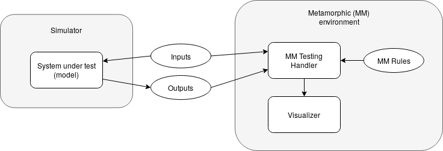

# mmpy
Python handler to ease metamorphic testing in simulations.

## Applying Metamorphic Testing to custom models 



### Inputs/Outputs
Inputs and outputs are assumed to be managed throught text files. The values in each port is defined in idividual files. Each line in these files has a pair of "[simulation_time] [value]", sorted by simulation time. An example can be seen below:
```
00:00:01 0
00:00:20 1
00:00:30 1
00:00:40 0
00:00:50 1
00:01:20 0
00:01:30 1
```

The inputs and outputs of the system are defined in two dictionaries as follow. The keys of these dictionaries are the identifiers of the ports (used later in the relation functions) and the values are the names of the files.
```
IN_PATH = "path/to/the/input/folder/"
OUT_PATH = "path/to/the/output/folder/"

INPUTS = {"in_port_0": "inPort0.txt",
          "in_port_1": "inPort1.txt"}

OUTPUTS = {"out_port_0": "outPort0.txt",
           "out_port_1": "outPort1.txt",
           "out_port_2": "outPort2.txt"}

```

### Metamorphic Relations
Metamorphic Relations are expressed as Python functions. These functions receive two dictionaries as arguments defining the current input and output values. They must contain one or more asertions checking a specific property of the system. As example is shown below:
```
def relation_1(inputs, outputs):
  if outputs["out_port_0"] == 0:
    assert outputs["out_port_1"] == 0
    assert outputs["out_port_2"] == 0
    
def relation_2(inputs_outputs):
  assert outputs["out_port_1"] <= outputs["out_port_2"]
  
MM_RELATIONS = {"relation1": relation_1,
                "relation2": relation_2}
```

### Instantiate MetamorphicTestingHandler
The MetamorphicTestingHandler is instantiated with the information specified above, as follows:
```
mmth = MetamorphicTestingHandler(INPUTS, OUTPUTS,
                                 in_path_prefix=IN_PATH,
                                 out_path_prefix=OUT_PATH,
                                 relations=MM_RELATIONS,
                                 visualizer=None)
```

When instatiated, the checking of the relations is executed with the run method:
```
mmth.run()
```
This calls all the relations defined above with the state of every step in the simulation time (as defined in the input/output files). An AssertionError is raised if some of the relations is not accomplished.

### Adding a Visualizer
An optional Visualizer can be pass to the MetamorphicTestingHandler to represent each state of the simulation graphically. A CustomVisualizer class must extend the following interface:
```
class Visualizer(ABC):

    @abstractmethod
    def update(self, wr):  # Updates the model based on the information in the tesing handler
        pass

    @abstractmethod
    def show(self):  # Show the updated information graphically
        pass
```

Some examples can be found in the "Building Automation" and "Car" examples.


